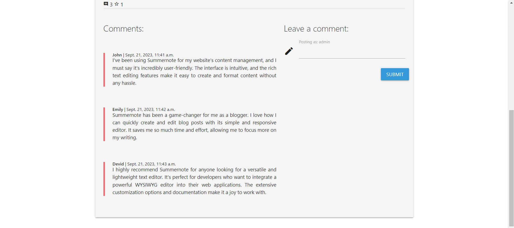
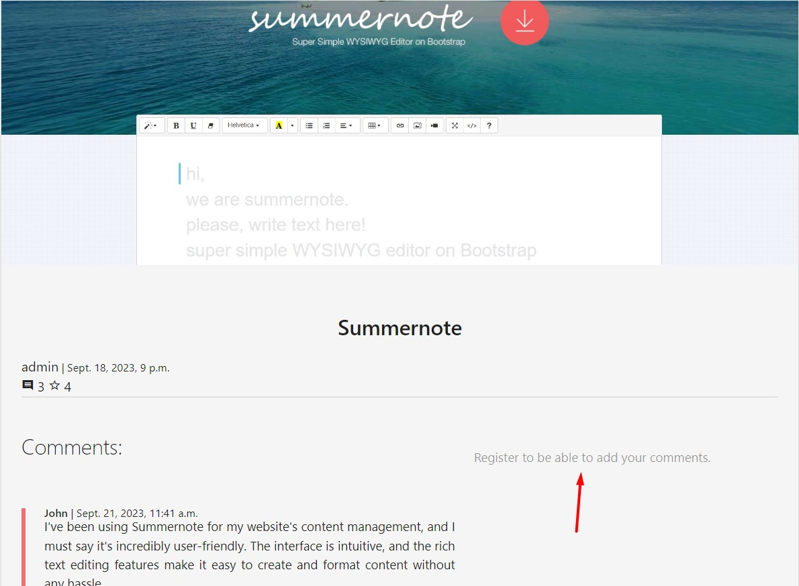

# 

## Introduction
List of Links is a curated collection of useful resources for web developers. The site contains links, screenshots and descriptions of websites, tools, tutorials, and more. Whether you're looking for inspiration, learning a new skill, or searching for a solution to a coding problem, List of Links has you covered. 
 
Users can browse the collection of resources by category or search for specific topics. The site aims to provide value to web developers of all skill levels. Each resource has been hand-picked and organized to save developers time searching the web. List of Links makes discovering high-quality web development resources simple and efficient.   
 
 Users can view resources, like posts and comment on resources. List of Links is a community platform where web developers can share knowledge and help each other improve their skills.

 The project was built keeping the Agile management principles in mind, and I utilised many of GitHub's features such as Issue and Projects to implement Scrum methodology.

[Kanban Board for project](https://github.com/users/satogako/projects/5)

[Closed Issues on GitHub for the project](https://github.com/satogako/list-of-links/issues?q=is%3Aissue+is%3Aclosed)

I used [GitHub issues](https://github.com/satogako/list-of-links/issues) for the product backlog containing the user stories.

CRUD functionality:
- All Categories - displays a list of resources and their approved comments
- Categories - shows resource details and its verified comments
- Approve comments - displays comments that need approval and allows the administrator to approve or delete them.
- resource_details.htm - shows details of the resource and its confirmed comments and also allows the registered user to send comments.
- class ResourseAdmirers - handles liking and disliking resources.
- class ApprovalCommentsView - displays comments that need approval and allows the administrator to approve or delete them.

Screenshot of the product backlog

I used the tags feature in GitHub Issues for assigning story points, prioritising features based on [the MoSCoW method](https://en.wikipedia.org/wiki/MoSCoW_method), and categorising the user stories.

I used the [Milestones feature](https://github.com/satogako/list-of-links/milestones) to plan sprints and set deadlines.

## User Stories
User Stories can been seen below under [User Story Testing](#user-story-testing), and in the [GitHub Issues](https://github.com/satogako/list-of-links/issues?q=is%3Aissue+is%3Aclosed) for full details including screenshots, story points and associated sprints.

## UX Design 
The UX design for this project aims to provide an intuitive and engaging experience for users. The layout and flow of the site focuses on simplicity while still maintaining an aesthetic appeal.

### Layout 
The layout utilizes a standard three-column design with a fixed navigation bar at the top. This ensures that all content is easily accessible while keeping the interface clean and minimal. The navigation links in the bar correspond to the main sections of the site. 
 
The content on each page is centered for easy reading and divided into cards for visual appeal. Important information like titles and authors are clearly displayed at the top of each card. A screenshot and brief description are also included to give users a quick overview and help them determine what resources are most relevant or interesting.

### Wireframes

### Colors

The color palette utilizes shades of blue, teal and grey to give the site a clean and minimal feel. The primary color used is a medium blue which is applied to interactive elements such as links and buttons. 

Teal shades are incorporated as accent colors to highlight important elements or convey meaning. For example, a teal sticker is used to prominently display the author of each resource on the main page. Teal is also used for the “sent for approval” chips on the comments page. 
 
Various shades of grey are used throughout the site for text, dividers and backgrounds.

Darker greys are applied to text.

While lighter greys are used for backgrounds and dividers. The specific shades of grey were chosen to provide sufficient contrast between elements while maintaining an understated and minimal style.

The vibrant shade of red color, is used sparingly to draw attention. This includes comments, delete button and logout. Its striking contrast against the primarily cool color palette ensures users notice and respond to these important elements.

The navigation bar utilizes shades of blue and teal to visually separate it from the rest of the page. The teal shade is used for the active link to clearly show the user their current location.  
The footer uses the same blue shade as the navigation bar for the background. The GitHub icon in the footer use teal on hover to match the accent color used throughout the site. This helps create a cohesive style across sections.

 
The selected color scheme aims to give the site a simple yet polished feel that focuses users’ attention on content over visual flair. The primarily neutral palette is accentuated with vibrant shades of blue and teal to highlight interactive elements and convey meaning in an intuitive fashion. Overall, the color choices reflect the clean and minimal aesthetic maintained throughout the design and layout of the site.

### Typography
The typography used in 'List of Links' is Roboto font. It is a minimal, geometric sans-serif typeface created by Christian Robertson and released by Google as an open-source font in 2011. 
 
Roboto has a dual nature. It has a mechanical skeleton and the forms are largely geometric. At the same time, the font features friendly and open curves. While some grotesks distort their letterforms to force a rigid rhythm, Roboto doesn’t compromise, allowing letters to be settled into their natural width. This makes for a more natural reading rhythm more commonly found in humanist and serif types. 
 
This typeface is well suited for any UI design as it's clean, minimal and has multiple weights and styles to choose from based on the context. The font renders well on screens and provides a pleasant reading experience for the users.

### Accessibility
The website has been designed keeping accessibility principles in mind to provide an inclusive experience for users with disabilities. The layout utilizes semantic HTML5 elements and ARIA attributes for screen readers. The color scheme also meets WCAG  [(Web Content Accessibility Guidelines)](https://www.w3.org/TR/WCAG21/#contrast-minimum) color contrast requirements.  
 
All interactive elements like buttons, links and form fields have clearly defined focus states. The site is navigable can use a keyboard.  
 
The content is written in a clear, concise manner using plain language to aid comprehension. All images have alt attributes and the site does not rely solely on visuals to convey information. 

Contrast cheker

## Existing Features

### Landing Page with Modal Window
A simple modal window, which opens automatically only when the user first visits the page, explains the purpose of the site. It has an OK button to close the window, and also closes when the mouse is clicked outside the area of this window. If necessary, the user can open this window by clicking on the site logo in the upper left corner of the page.

Modal Window Screenshot

### Navbar
The navigation bar is responsive and collapses to a hamburger menu on smaller devices. Navbar also uses active highlighting of the selected page, which provides the user with a clear understanding of which page he is on and facilitates site navigation.

If the user is logged in, their username will be displayed in the navigation bar and the dropdown menu will include:
- Username
- Logout

When a staff member is logged in, the drop-down menu contains:
- Approve comments
- Logout

Navbar Screenshot on Large Devices

Navbar Screenshot on Mobile Devices

### All Resources
The All Resources page is a selected catalog of all resources with screenshots, a short description and a link to the relevant resource.
Users can click the link to view the resource on its official website.
The user can view a screenshot of each resource in an enlarged form by simply clicking on the image.
Also, by clicking on the text with the description, the user can quickly view the comments to this resource, if they are there, or go to the page to view the comments in a larger window or write your own comment (provided the user is registered) by clicking the ADD YOUR OWN button COMMENT. If the user liked the resource, he can like it by clicking on the star icon (provided that the user is registered). There is also a comment icon next to the star, which indicates how many comments have already been made for this resource.

Quick view of the comments of the selected resource

Window for writing comments and viewing comments

### Categories
The Categories page allows users to filter resources by category. Users can click on category buttons at the top of the page to display resources with the selected tag. 
 
The page dynamically displays resources with the chosen category. Each resource is shown in a card format with title, author, description and link. Users can click the link to view the resource on its official website. 
 
The Categories page provides an easy way for developers to discover resources related to specific topics of interest. By filtering resources by category, users can efficiently find content relevant to their needs and skip over unrelated resources. The page aims to save developers time searching through all resources to find content on a particular subject. 
 
Overall, the Categories page allows for customized browsing of resources based on categories. Developers can explore content in areas of interest and discover new resources through an intuitive filtering system. The page provides a tailored experience to meet individual needs.

Category page

Category page with the selected category

### Register / Login
The registration page allows users to create an account by entering a username, email address and password. This page is intended for new users to access the site and its content.
 
The login page allows existing users to log into their account using a username or email address and password. This page is for returning users to access their account and site content.
 
On the registration page, users enter:
- Unique username
- Email address
- Password (enter twice for confirmation)
 
Clicking the "Sign Up" button sends user information and creates an account. After that, they get access to write comments and give likes.
 
On the login page, users enter:
- User name
- Their password
 
By clicking the "Login" button, the user is authenticated and logged into their account. After that, they get access to write comments and give likes.

These pages provide the necessary functionality for users to use the site.

Sign Up Page

Login Page

### Admirers
Users can star the resources they like, other users will see the total number of fans of each resource and will be able to view the most popular resources on the site.

Most Popular Resources

### Footer
The footer contains:
- The year the site was created.
- Link to [project GitHub repository](https://github.com/satogako/list-of-links).

### Notifications
The Materialized Toast element has been added to create an elegant notification when a user performs an action such as sending a message. Also, the user can see such messages as "no messages yet" and "register to be able to write comments". So that when the user sees an empty space, he can clearly understand what should appear there and what actions he needs to perform.

Sent for approval

No comments yet

Register to be able add your comments

### Staff Only Features
Features for staff only
The "Approve Comments" drop-down menu in the navigation bar is only visible to logged in employees and includes an additional page.

Unapproved comments
All unapproved comments submitted by registered users. Employees can approve.

Comments are welcome
All approved comments submitted by registered users. Employees can delete.

Staff will also be notified if there are no unapproved comments or no approved comments on the site, and the action buttons will not be available in this case.

Comments for approval

Approved comments (mark to remove)

There are no comments for approval

### Favicon

  - A favicon and icon for iOS/Android home screen bookmarks is included with the project's logo.

***

### Features remaining to be implemented
- I could not reproduce the screenshots of the resources in the cards as it is implemented on the All Resources page. I attribute this to the fact that the serializer.py file does not pass the full image address from Cloudinary to json. Also could not reproduce the card creation date. In my opinion, date data is transferred in json in a different format than with Django. What I haven't figured out yet. After fixing these problems, I plan to add these features. (I would greatly appreciate it if you could provide your expert opinion on how to fix these issues and provide feedback on whether I'm heading in the right direction. Is it better to implement these features without using the Alpine.js framework, but only with JavaScript?)
  

  
Screenshot json

  

  

- Add a quick view of the comments of each resource. Since this is implemented on the All Resources page when clicking on the description text.
- Add the ability to comment and review comments on a separate page.
- Add registration on the site using a Google account and using GitHub.
- Add the ability for users to add their own resources
- Add an opportunity for the admin to approve added resources by users.
- Write code to the  script.js for the comment form so that when you click on this form, the cursor always moves to the beginning of the line.
- Add a notification to the user if he enters an incorrect password or login

## Technologies Used
- [Python](https://www.python.org/)
- [pip](https://pip.pypa.io/en/stable/) for installing Python packages.
- [Git](https://git-scm.com/) for version control.
- [GitHub](https://github.com/) for storing the repository online during development.
- GitHub Projects was invaluable throughout the project and helped me keep track of things to do and bugs to fix - you can see [the project's board here](https://github.com/users/davidindub/projects/7).
- [VS Code](https://code.visualstudio.com/) local IDE.
- [Balsamiq](https://balsamiq.com/wireframes/) for wireframing.
- [Materialize](https://materializecss.com/) as a front end framework.
- [Google Chrome](https://www.google.com/intl/en_ie/chrome/), [Mozilla Firefox](https://www.mozilla.org/en-US/firefox/new/) and [Opera](https://www.opera.com/) for testing on Windows.
- [Google Chrome](https://www.google.com/intl/en_ie/chrome/) on Android 12.
- [favicon.io](https://favicon.io/favicon-generator/) to make a favicon for site.
- [Alpine.js](https://alpinejs.dev/) lightweight JavaScript framework designed for building interactive web interfaces with minimal overhead.
- [jQuery](https://jquery.com/) to simplify working with JavaScript on the client side of web pages.
- [LogoMakr](https://logomakr.com/) to create logos and graphic designs online.s

## External Python Packages Used
- [django-taggit](https://github.com/jazzband/django-taggit) to provide generic tagging functionality for the models
- [django-rest-framework](https://www.django-rest-framework.org/) to build an API for the project that can be used by third party clients.

### Browser Compatibility
I tested the website on two different operating systems on three different types of hardware and didn't find any rendering bugs between the browsers tested.

| Operating System | Chrome  | Firefox | Opera|
|------------------|---------|---------|------| 
| Windows 10       | Ok      | Ok      | Ok   | 
| Android 12       | Ok      | Ok      | Ok   | 

## Testing 
During the project development, I consistently performed manual testing. I maintained a record of error reproduction steps, expected behavior, screenshots of issues, and their resolutions to assist myself in the future.

### Responsiveness 
I tested for responsiveness on many different sized viewports from 320px wide up to Ultrawide resolutions, and using different hardware (Monitors, Laptops, Phones).

### Performance Testing
Performed using [Google Lighthouse](https://developer.chrome.com/docs/lighthouse/overview/) in Google Chrome.

Detailed Lighthouse Testing

__Desktop__

| Page               | Performance | Accessibility | Best Practices | SEO |
|--------------------|-------------|---------------|----------------|-----|
| All Resources      | 96          | 96            | 100            |100  |
| comment page       | 99          | 96            | 100            |100  |
| Categories         | 93          | 97            | 100            |100  |
| Register           | 100         | 97            | 100            |100  |
| Login              | 97          | 97            | 100            |100  |
| Approve comments   | 96          | 98            | 100            |100  |
| Logout             |100          | 97            | 100            |100  |

__Mobile__

| Page               | Performance | Accessibility | Best Practices | SEO |
|--------------------|-------------|---------------|----------------|-----|
| All Resources      | 93          | 96            | 100            |100  |
| comment page       | 88          | 96            | 100            |100  |
| Categories         | 93          | 97            | 100            |100  |
| Register           | 95          | 97            | 100            |100  |
| Login              | 95          | 97            | 100            |100  |
| Approve comments   | 93          | 98            | 100            |100  |
| Logout             | 91          | 97            | 100            |100  |

### User Story Testing

As a Site User I can view a list of posts so that I can select one to read

#### Acceptance Criteria

- When you open the home page, you can easily understand the purpose of the site.
 - The user can view the list of resource publications

**Result:** ☑ Pass

As a Site User I can view a paginated list of posts so that easily

#### Acceptance Criteria

 - The page have no more than 9 resources
 - The results are sorted in reverse order. Newer publications at the beginning and older at the end

**Result:** ☑ Pass

As a Site User I can click on a post so that I can read the full text

#### Acceptance Criteria

- After selecting a resource, the user can click on the ADD YOUR COMMENT button and open the comments page

**Result:** ☑ Pass

As a Site User / Admin I can view the number of likes on each post so that I can see which is the most popular or viralt

#### Acceptance Criteria

- User can see the number of likes next to the star icon

**Result:** ☑ Pass

As a As a Site User / Admin I can view comments on an individual post so that I can read the conversation

#### Acceptance Criteria

- By clicking on the text of the resource description, the user or admin can see the comments.
- By clicking the ADD YOUR COMMENT button, the user or administrator can see comments in a larger window.
- Add styles to the index.html and resource_details.html pages so that the user can freely navigate between comments.
- Add an image and title to resource.html that matches the resource the user selected.

**Result:** ☑ Pass

As a Site User I can register an account so that I can comment and like

#### Acceptance Criteria

- The user can register using a login and a password on the site 

**Result:** ☑ Pass

As a Site User I can leave comments on a post so that I can be involved in the conversation

#### Acceptance Criteria

- The comment form is displayed only when the user is registered
- The user can write his comment and send it.
- The comment is sent to the administrator for approval.
- After sending a comment, the user receives a message that the comment must be approved 

**Result:** ☑ Pass

As a Site User I can like or unlike a post so that I can interact with the content

#### Acceptance Criteria

- A registered user can like it by clicking on the star on the resource_details.html page 

**Result:** ☑ Pass

As a Site Admin I can create, read, update and delete posts so that I can manage my blog content

#### Acceptance Criteria

- Creat database models
- Build the admin page
- Admin have the ability to post new comments on the admin page
- Install a text editor on the admin page
- Add the ability to filter posts
- Add search box 

**Result:** ☑ Pass

As a Site Admin I can create draft posts so that I can finish writing the content later

#### Acceptance Criteria

- The Admin has the ability to write a draft

**Result:** ☑ Pass

As a Site Admin I can approve or disapprove comments so that I can filter out objectionable comments

#### Acceptance Criteria

- The Admin must be able to reject or approve comments 

**Result:** ☑ Pass

As a User I can easily understand the purpode of the registration form so that I can easily use it

#### Acceptance Criteria

- Provide styles to the registration form, password input form, and exit form.
- Connect form pages: login, logout and register to the navigation bar

**Result:** ☑ Pass

As a User I can sort resources by category so that quickly select the resources I need

#### Acceptance Criteria

- The user can easily understand the purpose of the categories page
- On the categories page, the user can sort resources using buttons 

**Result:** ☑ Pass

As a Admin I can approving and deleting comments on the "Approve comments" page so that make the approval or removal process faster.

#### Acceptance Criteria

- Only an administrator can open the Approve "Comments page".
- The administrator can approve or delete comments on the "Approve comments page".
- Add styles to the "Approve comments page". 

**Result:** ☑ Pass

### Challenges Faced
- The use of `Alpine.js` in HTML code is a source of errors when checked by the HTML validator. I added screenshots of these errors in the next section. In future projects, I will use more JavaScript or jQuery code to avoid this.
- Due to the fact that the Codeanywhere IDE workspace sometimes hangs or takes a long time to open, a decision was made during the writing of the project to switch to the local VS Code IDE. This caused some time to configure the IDE itself and connect to the GitHub repository.
- In the HTML templates in the `templates/` folder, the code is indented by four spaces, and in the copied templates of the `django-allauth` library in the `templates/account` folder, the HTML code is indented by two spaces. This is due to the fact that I did not fully configure the VS Code IDE due to lack of time. In the next project, I am going to fix this and set the same indentation standard of two spaces for all project files.